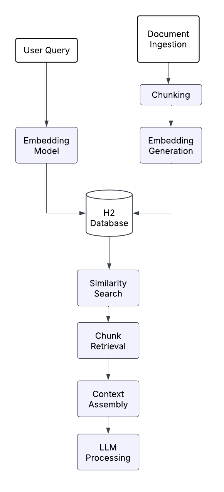

# RAGNavigator

## Description
RAGNavigator is a Spring Boot application designed for Retrieval-Augmented Generation (RAG). It processes static files, generates embeddings, stores them in a database, and integrates with a local `llama.cpp` instance for intelligent response generation.

### Key Features:
- **Document Ingestion & Preprocessing**: Handles file uploads (PDF, DOCX, TXT, MD, RTF) using Apache Tika for parsing, text extraction, and validation.
- **Document Chunking/Splitting**: Employs a recursive chunking strategy (`DocumentSplitters.recursive(500, 50)`) with overlap handling for efficient information retrieval.
- **Embedding Generation**: Utilizes `AllMiniLmL6V2EmbeddingModel` for creating vector embeddings, which are then serialized and stored in the database.
- **Vector Storage & Retrieval**: Leverages JPA/Hibernate for database storage, enabling cosine similarity calculations and batch processing for efficient similarity searches.
- **Query Processing**: Generates query embeddings, performs semantic similarity searches, and builds context from retrieved documents.
- **Response Generation**: Integrates with a local LLM (`llama.cpp`) to construct context-aware prompts and generate responses.

## RAG Flow
User Query → Query Embedding → Similarity Search → Context Retrieval → Prompt Construction → LLM Generation → Response

## Technology Stack
- **Backend**: Spring Boot (Java)
- **Document Parsing**: Apache Tika
- **Embedding Model**: AllMiniLmL6V2EmbeddingModel
- **Database**: H2 Database (in-memory for development, configurable for persistence)
- **LLM Integration**: `llama.cpp` (local LLM)
- **Frontend**: HTML, CSS (for the chat interface)

## Prerequisites
Before you begin, ensure you have the following installed:
- **Java Development Kit (JDK)**: Version 17 or higher.
- **Apache Maven**: For building and managing the project.
- **llama.cpp**: Compiled and ready to run locally. Follow the instructions on the official `llama.cpp` GitHub repository for installation.
- **Compatible LLM Model**: A `.gguf` model file compatible with `llama.cpp` (e.g., `llama-2-7b-chat.Q4_K_M.gguf`).

## Configuration
- **`application.properties`**: This file, located in `src/main/resources/`, contains the main application settings. You will need to update the path to your `llama.cpp` executable and the LLM model file.
  ```properties
  # Example configuration in application.properties
  llama.cpp.path=/path/to/your/llama.cpp/build/bin/llama-server
  llama.cpp.model=/path/to/your/llama.cpp/models/llama-2-7b-chat.Q4_K_M.gguf
  
  # H2 Console (for debugging)
  spring.h2.console.enabled=true
  spring.h2.console.path=/h2-console
  spring.jpa.show-sql=false
  ```
- **Code Configuration**: Ensure any hardcoded paths in the Java code (e.g., `RAGNavigator.java`, `LlamaService.java`) are updated to reflect your environment, especially for initial document indexing directories.

## Getting Started
Follow these steps to get the RAGNavigator application up and running:

### 1. Clone the Repository
```bash
git clone https://github.com/your-repo/RAGNavigator.git
cd RAGNavigator
```

### 2. Build the Application
```bash
mvn clean install
```

### 3. Prepare `llama.cpp`
- Compile `llama.cpp` if you haven't already.
- Download a compatible `.gguf` model and place it in a known location.

### 4. Run `llama.cpp` Server
Open a new terminal and start the `llama.cpp` server. Adjust the model path and other parameters as needed.
```bash
./build/bin/llama-server -m /path/to/your/llama-2-7b-chat.Q4_K_M.gguf --port 8081 --ctx-size 2048 --n-gpu-layers 1 -t 8 -b 1024 --mlock --no-mmap
```

### 5. Run the Spring Boot Application
```bash
mvn spring-boot:run
```
The application will typically start on `http://localhost:8080/`.

### 6. Access the Web Interface
Open your web browser and navigate to `http://localhost:8080/` to access the chat interface.

### 7. Index Documents (API Endpoints)
Use the following API endpoints to index your documents. Replace `/path/to/your/documents` with the actual directory containing your files.

- **Index a specific file (e.g., `my_document.pdf`)**:
  ```bash
  curl -X POST http://localhost:8080/api/rag/index-file -H "Content-Type: application/json" -d '{"filePath": "/path/to/your/documents/my_document.pdf"}'
  ```

- **Index all documents in a directory**:
  ```bash
  curl -X POST http://localhost:8080/api/rag/index-directory -H "Content-Type: application/json" -d '{"directoryPath": "/path/to/your/documents"}'
  ```

### 8. Query the RAG System
Once documents are indexed, you can start asking questions:
```bash
curl -X POST http://localhost:8080/api/rag/query -H "Content-Type: application/json" -d '{"question": "What is the main topic discussed in the documents?"}'
```

### Other API Endpoints
- `POST /api/rag/clear`: Clear all indexed documents from the database.

## Architecture
This diagram illustrates the workflow of a document processing and user query system. It begins with document ingestion and user queries, which are then processed through chunking and embedding models. The workflow integrates an H2 database for embedding storage and facilitates similarity search for chunk retrieval. Finally, it assembles context for LLM processing.


## Debugging Steps
- **H2 Console**: Access the in-memory database console at `http://localhost:8080/h2-console` (default credentials: `sa`/`password`).
- **Enable SQL logging**: Set `spring.jpa.show-sql=true` in `application.properties` to see SQL queries in the console.